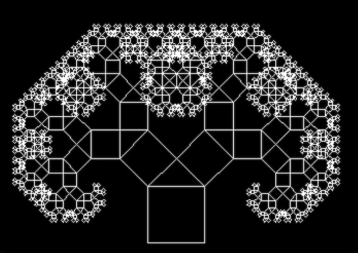
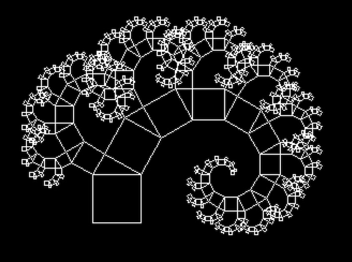

# retro-tree-of-pythagoras
Tree of Pythagoras in BBC Basic

## sources
- Albert Koelmans, It's all Greek, _Acorn User_, 1987-02, AU055, p. 95 -- 99
- Patrick McTiernan, Acorn Forum "Greek Revision", _Acorn User_, 1987-06, AU059, p. 55
- https://en.wikipedia.org/wiki/Pythagoras_tree_(fractal)

## how to run
- open this: https://bbc.godbolt.org/
- paste the code into jsbeeb and `RUN` it

## output
It makes two plots.

First:

`DATA 640,110,0,10,45`

Second: 

`DATA 375,90,150,15,30`
