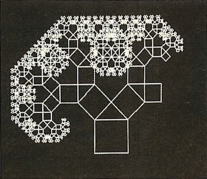

# retro-tree-of-pythagoras
Tree of Pythagoras in BBC Basic

## sources
- Albert Koelmans, It's all Greek, __Acorn User__, 1987-02, AU055, p. 95 -- 99
- Patrick McTiernan, Acorn Forum "Greek Revision", __Acorn User__, 1987-06, AU059, p. 55
